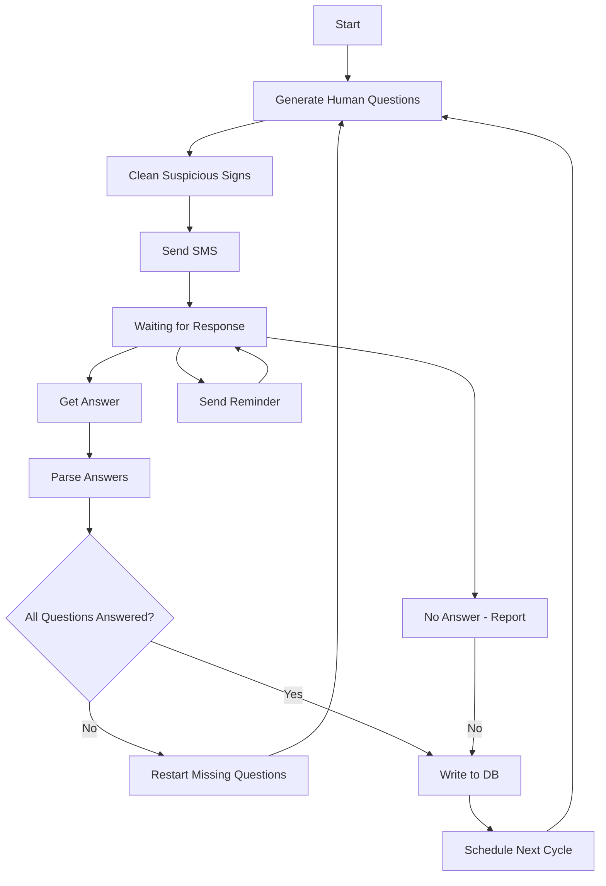

# AI reported

## Description
Daily/weekly/monthly report managed by AI, send questions via SMS to get a daily/weekly/monthly report from your employee,
the question looks like a human question and not a AI question that is repeated all the time.
also scheduled questions in a time interval to make it more humane.

## Components
1. Backend
2. Frontend
3. MCP server
4. Data Base

## Backend
### Main features
1. List Subjects - Gather questions to one subject, supported Append/Remove/Edit/Move.  
  Append - append now subject to list.  
  Remove - side efect Remove all question related to this subject.  
  Edit   - side efect move all question from old subject to new subject.  

2. List Question - Questions to report, A question may or may not be related to subject, supported Append/Remove/Edit.  

3. Subject update - moving a question from one Subject to another

4. Mark a question answered.

5. Reminder - managed not answerd questions supported Set_interval/repetitions_number(1-4)
   
6. Scheduled Times - Time to send a question via SMS supported Time interval or fixed time
### APIs

* add_subject
* remove_subject
* edit_subject
* list_subject

* add_question
* remove_question
* edit_question
* change_subject
* list_question_from_subject

* set_reminder_interval
* repetitions_number_for_reminder

* send_questions  
### AI Graph

#### List nodes:
start - Start the process  
genereted_human_questions - iterate over questions and create new question same as the old question it's look like more humane, not send over and over exacly same questions
delete_suspicious_signs - iterate over the now list questions and remove AI sign such as long hyphen
send_sms - send SMS to list of phones
waiting_for_response - after the SMS sent waiting for a response
get_answer - getting response via SMS
parse_answers - split the response and examine which question answered and mark it answered
all_question_answerd -  and finally check if all questions answered
start_from_first_if_some_question_not_answerd - if not all question answer, generate new questions for the unanswered questions
send_reminder - send reminder if not response coming, repoit N times
not_answered_and_report -  No response after several attempts.
write_to_db - write all data to Database include: Questions, original response, AI split response, time, user data, answerd time
schedule_time - The user specifies a time interval for sending the questions, select a time from the user's time interval.

nodes:
  - id: start  
    type: input

  - id: genereted_human_questions  
    type: tool

  - id: delete_suspicious_signs  
    type: tool

  - id: send_sms  
    type: tool

  - id: waiting_for_response  
    type: state

  - id: send_reminder  
    type: tool

  - id: not_answered_and_report  
    type: tool

  - id: get_answer  
    type: tool

  - id: parse_answers  
    type: tool

  - id: all_question_answerd  
    type: router

  - id: start_from_first_if_some_question_not_answerd  
    type: tool

  - id: write_to_db  
    type: output

  - id: schedule_time  
    type: scheduler  

edges:
  - from: start  
    to: genereted_human_questions

  - from: genereted_human_questions
    to: delete_suspicious_signs

  - from: delete_suspicious_signs  
    to: send_sms

  - from: send_sms  
    to: waiting_for_response

  #### Response handling
  - from: waiting_for_response
    to: get_answer

  - from: get_answer
    to: parse_answers

  - from: parse_answers
    to: all_question_answerd

  - from: all_question_answerd
    to: write_to_db
    condition: all_answered

  - from: all_question_answerd
    to: start_from_first_if_some_question_not_answerd
    condition: missing_answers

  - from: start_from_first_if_some_question_not_answerd
    to: genereted_human_questions 
  #### Reminder loop
  - from: waiting_for_response
    to: send_reminder
    condition: timeout_warning

  - from: send_reminder
    to: waiting_for_response

  #### Failure path
  - from: waiting_for_response
    to: not_answered_and_report
    condition: no_response_timeout

  - from: not_answered_and_report
    to: write_to_db

  #### Scheduling loop
  - from: write_to_db
    to: schedule_time

  - from: schedule_time
    to: genereted_human_questions  

## Frontend

### Pages
1. Subjects   
2. Questions  
3. Reminders  

#### Subjects Page:
 Add Subject  
 List Subjects  
 Delete Subject  

#### Questions Page:
 Select Subject  
 Add Question  
 List Questions  
 Delete Question  

#### Reminders Page:
  Set Interval  
  Set Repetitions  
  Send Questions  

## MCP Server

### Tools
* send_sms
* send_reminder
* generate_questions
* clean_suspicious_signs
* write_to_db
* not_answered_and_report