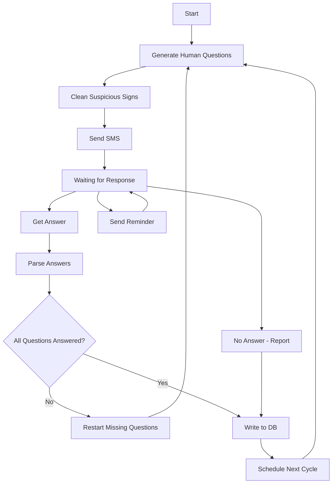

# AI reported

## Description
Daily/weekly/monthly report managed by AI, send questions via messaging to get a daily/weekly/monthly report from your employees.
The questions look like human questions, not AI questions that are repeated all the time.
Questions are also scheduled in a time interval to make it more human.

## Components
1. Backend
2. Frontend
3. MCP server
4. Database

## Backend

### Main features

1. List Subjects - Gather questions into one subject, supported: Append/Remove/Edit/Move.
   - Append: add new subject to list.
   - Remove: removes all questions related to this subject (side effect).
   - Edit: moves all questions from old subject to new subject (side effect).

2. List Questions - Questions to report. A question may or may not be related to a subject, supported: Append/Remove/Edit.

3. Subject update - move a question from one subject to another.

4. Mark a question as answered.

5. Reminder - manage unanswered questions, supported: Set_interval / repetitions_number (1-4).

6. Scheduled Times - time to send questions via messaging, supported: time interval or fixed time.

### APIs

* add_subject
* remove_subject
* edit_subject
* list_subject

* add_question
* remove_question
* edit_question
* change_subject
* list_question_from_subject

* set_reminder_interval
* repetitions_number_for_reminder

* send_questions

---

### AI Graph



#### List nodes

| Node | Description |
|---|---|
| start | Start the process |
| genereted_human_questions | Iterate over questions and rewrite each to sound human. Never send the exact same question twice. |
| delete_suspicious_signs | Iterate over the question list and remove AI signs such as long hyphens |
| send_sms | Send questions to a list of phone numbers via the configured channel |
| waiting_for_response | Hold state after message is sent, waiting for a response |
| get_answer | Receive the response via messaging |
| parse_answers | Split the response, match each answer to its question, mark answered/unanswered |
| all_question_answerd | Check if all questions are answered and route accordingly |
| start_from_first_if_some_question_not_answerd | Generate new questions only for unanswered ones |
| send_reminder | Send a reminder if no response has arrived, repeat up to N times |
| not_answered_and_report | No response after N attempts — log and report the failure |
| write_to_db | Write all session data to the database |
| schedule_time | Select the next send time from the user-defined time interval |

#### Nodes

```yaml
nodes:
  - id: start
    type: input

  - id: genereted_human_questions
    type: tool

  - id: delete_suspicious_signs
    type: tool

  - id: send_sms
    type: tool

  - id: waiting_for_response
    type: state

  - id: send_reminder
    type: tool

  - id: not_answered_and_report
    type: tool

  - id: get_answer
    type: tool

  - id: parse_answers
    type: tool

  - id: all_question_answerd
    type: router

  - id: start_from_first_if_some_question_not_answerd
    type: tool

  - id: write_to_db
    type: output

  - id: schedule_time
    type: scheduler
```

#### Edges

```yaml
edges:
  - from: start
    to: genereted_human_questions

  - from: genereted_human_questions
    to: delete_suspicious_signs

  - from: delete_suspicious_signs
    to: send_sms

  - from: send_sms
    to: waiting_for_response

  # Response handling
  - from: waiting_for_response
    to: get_answer

  - from: get_answer
    to: parse_answers

  - from: parse_answers
    to: all_question_answerd

  - from: all_question_answerd
    to: write_to_db
    condition: all_answered

  - from: all_question_answerd
    to: start_from_first_if_some_question_not_answerd
    condition: missing_answers

  - from: start_from_first_if_some_question_not_answerd
    to: genereted_human_questions

  # Reminder loop
  - from: waiting_for_response
    to: send_reminder
    condition: timeout_warning

  - from: send_reminder
    to: waiting_for_response

  # Failure path
  - from: waiting_for_response
    to: not_answered_and_report
    condition: no_response_timeout

  - from: not_answered_and_report
    to: write_to_db

  # Scheduling loop
  - from: write_to_db
    to: schedule_time

  - from: schedule_time
    to: genereted_human_questions
```

---

## Frontend

### Pages

1. Subjects
2. Questions
3. Reminders

#### Subjects Page

- Add Subject
- List Subjects
- Delete Subject

#### Questions Page

- Select Subject
- Add Question
- List Questions
- Delete Question

#### Reminders Page

- Set Interval
- Set Repetitions
- Send Questions

---

## MCP Server

### Tools

* send_message
* send_reminder
* generate_questions
* clean_suspicious_signs
* write_to_db
* not_answered_and_report