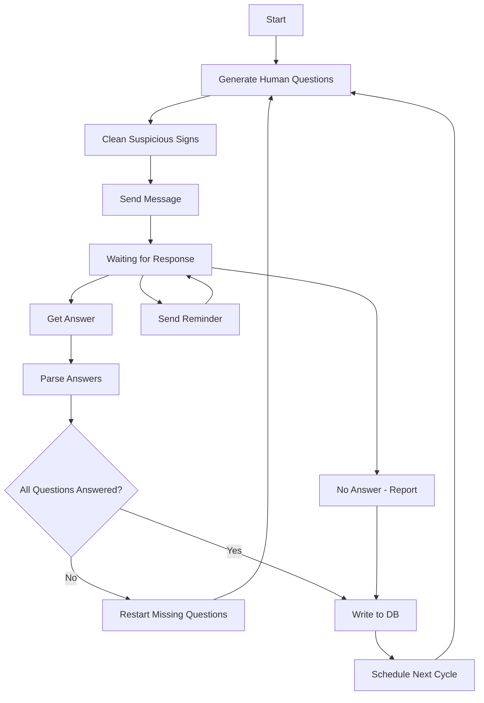

# Backend

The backend is responsible for managing subjects, questions, reminders, and scheduling.
It exposes a REST API consumed by the frontend and triggers the AI graph when questions need to be sent.

---

## Main Features

### 1. Subjects
Gather questions under one subject. Supported operations: Append / Remove / Edit / Move.

- **Append**: add a new subject to the list.
- **Remove**: removes the subject and all questions related to it (side effect).
- **Edit**: renames the subject and moves all its questions to the new name (side effect).

### 2. Questions
Questions used in reports. A question may or may not be linked to a subject.
Supported operations: Append / Remove / Edit.

### 3. Subject Update
Move a question from one subject to another.

### 4. Mark Question Answered
Mark a specific question as answered in a session.

### 5. Reminder
Manage follow-up for unanswered questions.
Supported: `set_interval` / `repetitions_number` (1-4 times).

### 6. Scheduled Times
Define when questions are sent via messaging.
Supported: time interval (e.g. between 9am-11am) or fixed time.

---

## APIs

### Subjects

| Method | Endpoint | Description |
|---|---|---|
| POST | `/subjects` | Add a new subject |
| DELETE | `/subjects/:id` | Remove a subject and its questions |
| PUT | `/subjects/:id` | Edit a subject name |
| GET | `/subjects` | List all subjects |

### Questions

| Method | Endpoint | Description |
|---|---|---|
| POST | `/questions` | Add a new question |
| DELETE | `/questions/:id` | Remove a question |
| PUT | `/questions/:id` | Edit a question |
| PUT | `/questions/:id/subject` | Move question to a different subject |
| GET | `/subjects/:id/questions` | List all questions for a subject |

### Reminders

| Method | Endpoint | Description |
|---|---|---|
| PUT | `/reminders/interval` | Set the reminder interval |
| PUT | `/reminders/repetitions` | Set repetitions count (1-4) |

### Trigger

| Method | Endpoint | Description |
|---|---|---|
| POST | `/send` | Trigger the AI graph to send questions |

---

## AI Graph

The AI graph is the core engine of the backend. It is orchestrated by LangGraph
and uses MCP tools for all external operations.

### Flow Overview



### Node Reference

| Node | Type | MCP | Description |
|---|---|---|---|
| `start` | input | - | Start the process |
| `genereted_human_questions` | tool | yes | Rewrite questions to sound human, never repeat exactly |
| `delete_suspicious_signs` | tool | yes | Remove AI signs such as long hyphens |
| `send_sms` | tool | yes | Send questions via configured messaging channel |
| `waiting_for_response` | state | - | Hold state while waiting for a reply |
| `get_answer` | tool | yes | Receive the incoming message response |
| `parse_answers` | tool | yes | Match response parts to questions, mark answered/unanswered |
| `all_question_answerd` | router | - | Route: all answered → DB, missing → retry |
| `start_from_first_if_some_question_not_answerd` | tool | yes | Generate new questions for unanswered ones only |
| `send_reminder` | tool | yes | Send reminder, repeat up to N times |
| `not_answered_and_report` | tool | yes | Report failure after N unanswered attempts |
| `write_to_db` | output | yes | Persist full session data to database |
| `schedule_time` | scheduler | - | Pick next send time from user-defined interval |

### Graph State Schema

```python
class GraphState(TypedDict):
    session_id: str
    phone_numbers: list[str]
    channel: str                    # "sms" | "whatsapp"
    questions: list[str]
    answers: dict[str, str]         # question -> answer
    original_response: str
    reminder_count: int
    max_reminders: int
    schedule_interval: tuple[str, str]  # ("09:00", "11:00")
    completed_at: str | None
```

### Edges

```yaml
edges:
  - from: start
    to: genereted_human_questions

  - from: genereted_human_questions
    to: delete_suspicious_signs

  - from: delete_suspicious_signs
    to: send_sms

  - from: send_sms
    to: waiting_for_response

  - from: waiting_for_response
    to: get_answer

  - from: get_answer
    to: parse_answers

  - from: parse_answers
    to: all_question_answerd

  - from: all_question_answerd
    to: write_to_db
    condition: all_answered

  - from: all_question_answerd
    to: start_from_first_if_some_question_not_answerd
    condition: missing_answers

  - from: start_from_first_if_some_question_not_answerd
    to: genereted_human_questions

  - from: waiting_for_response
    to: send_reminder
    condition: timeout_warning

  - from: send_reminder
    to: waiting_for_response

  - from: waiting_for_response
    to: not_answered_and_report
    condition: no_response_timeout

  - from: not_answered_and_report
    to: write_to_db

  - from: write_to_db
    to: schedule_time

  - from: schedule_time
    to: genereted_human_questions
```