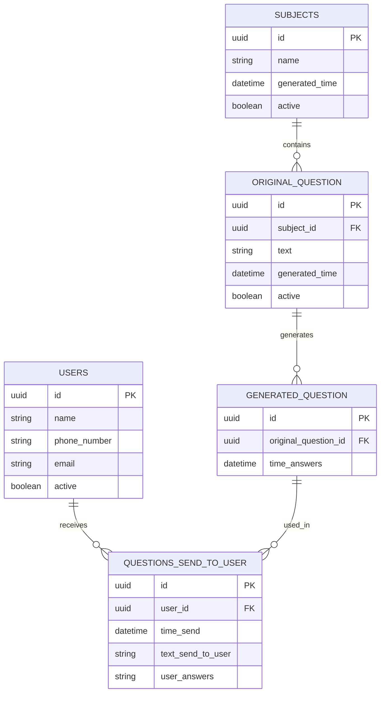

# db reportloop

## tables:
* users
* subjects
* original_question
* generated_question
* questions_send_to_user

---

# DATA MODEL

## USERS
------------------------
id: uuid  
name: string  
phone_number: string  
email: string  
active: boolean  

---

## SUBJECTS
------------------------
id: uuid  
name: string  
generated_time: datetime  
active: boolean  

---

## ORIGINAL_QUESTION
------------------------
id: uuid  
subject_id: uuid → subjects.id  
text: string  
generated_time: datetime  
active: boolean  

---

## GENERATED_QUESTION
------------------------
id: uuid  
original_question_id: uuid → original_question.id  
time_answers: datetime  

---

## QUESTIONS_SEND_TO_USER
------------------------
id: uuid  
user_id: uuid → user.id  
time_send: datetime  
text_send_to_user: string  
user_answers: list<string>  

---

# FLOW

Subjects 
  → Original Questions
    → Generated Questions
      → Questions sent to Users
Users ↔ receive / answer QuestionsSendToUser

---

# ER DIAGRAM

---

## Notes

- **SUBJECTS → ORIGINAL_QUESTION**
  → A subject contains multiple original questions.

- **ORIGINAL_QUESTION → GENERATED_QUESTION**
  → AI generates variations or derived questions.

- **GENERATED_QUESTION -> QUESTIONS_SEND_TO_USER**
  → Each record represents a sent instance of an AI-generated question delivered to users.

- **USERS → QUESTIONS_SEND_TO_USER**
  → Each user receives multiple question messages.
