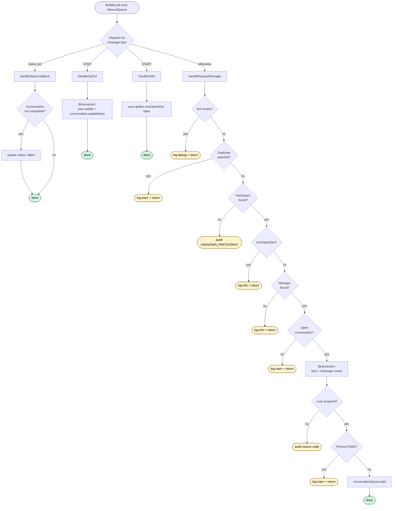

# Inbound Webhook Routing

> **Status:** Implemented in v1.2.
> **Plan history:** `version-1.2.md` Step 16.

The Twilio inbound webhook pipeline. Receives participant SMS replies,
delivery status callbacks, and STOP/START opt-out keywords. Routes by
`From` (participant phone) + `To` (manager's assigned number) — there
is no global fallback number.

---

## Architecture — two-queue async

```
Twilio → routes/webhooks.ts → inboundQueue (Redis) → return 200
                                       ↓
                              jobs/inbound.worker.ts
                                ├── handleStatusCallback
                                ├── handleOptOut        ($transaction)
                                ├── handleOptIn
                                └── handleRegularMessage → conversationQueue
                                                                 ↓
                                                        conversation.worker.ts
```

**Why two queues:**
- Twilio's webhook timeout is 15 seconds. The route returns 200 after a
  sub-millisecond Redis write — DB blips can't push us over.
- BullMQ retry + dead-letter machinery handles every downstream failure
  (5 attempts with exponential backoff: 1s/2s/4s/8s/16s).
- Workers scale independently of the HTTP layer.

---

## Detailed flow

### HTTP edge — `webhooks.ts`


### Worker — `inbound.worker.ts`



---

## Files

| File | Role |
|---|---|
| `routes/webhooks.ts` | Thin gate — validates signature, runs guards, enqueues, returns 200/403/500 |
| `jobs/queue.ts` | Declares `inboundQueue` (alongside `conversationQueue` and `broadcastQueue`) |
| `jobs/inbound.worker.ts` | All business logic — dispatch + 4 handlers + worker factory |
| `index.ts` | Registers `startInboundWorker()` behind `config.twilio` guard, closes on shutdown |
| `prisma/schema.prisma` | `InboundAuditLog.toPhone` records destination number on permanent failures |

---

## Configuration

| Env var | Default | Purpose |
|---|---|---|
| `INBOUND_WORKER_CONCURRENCY` | `5` (range 1–50) | BullMQ worker concurrency. Set to `1` in `.env.local` for sequential debugging. Per-conversation atomicity is enforced by `$transaction`, so > 1 is safe |

---

## Key design decisions

**Two-layer idempotency.** Twilio retries duplicates aggressively. Layer 1
is `jobId: smsSid` on `inboundQueue.add` — dedupes while the job is still
in the queue (cheap Redis lookup). Layer 2 is `message.findUnique({ twilioSid })`
in the worker — catches retries that arrive after the original job already
cleared from BullMQ. Both layers are needed; neither alone is sufficient.

**`$transaction` wraps lock + `message.create`.** Without the transaction:
lock succeeds, `message.create` fails with P2000 (body too long), worker
throws, BullMQ retries, but conversation is now `processing` — lock fails,
message lost. With the transaction: failed write rolls back the lock,
conversation stays `awaiting_reply`, retry can do the work cleanly.

**Discriminated return from the transaction**, not a sentinel error.
`{ locked: true } | { locked: false; currentStatus }`. Lock-not-acquired
is an *expected* outcome of normal status transitions, not exceptional;
keeping `try/catch` reserved for actual errors (P2000, real DB failures)
makes the catch block honest. See implementation plan D10.

**Conversation lookup uses nested relation.** `Conversation` has no
`managerId` field — manager is reached via `broadcast.schedule.managerId`.
Existing indexes cover the join (`schedules.manager_id`,
`broadcasts.schedule_id`, `conversations.[userId, status]`).

**Global opt-out scope.** STOP from any manager number opts the participant
out platform-wide.

**STOP/START keywords match Twilio's documented set:**
- Opt-out: `STOP`, `STOPALL`, `UNSUBSCRIBE`, `CANCEL`, `END`, `QUIT`
- Opt-in: `START`, `YES`, `UNSTOP`
- Match rule: exact, case-insensitive, trimmed.

**MMS rejected.** This webhook handles SMS only. Inbound multimedia is
dropped at the route level (`NumMedia > 0`).

**Status callbacks: only `failed` + `undelivered` act.** Other lifecycle
states (`queued`, `sending`, `sent`, `delivered`, `read`) are no-ops.
The conversation's `failReason` is set to `'TWILIO_DELIVERY_FAILED'`.
A `notIn: ['completed']` guard prevents a late-arriving failure callback
from overwriting a successful conversation.

---

## Notable edge cases

The non-obvious behaviours a maintainer should know:

| Scenario | Behaviour |
|---|---|
| Conversation in `processing` when reply arrives | Lock fails, audit log with `OUT_OF_TURN`. AI processes one reply at a time per conversation; subsequent replies are dropped, not queued |
| Participant STOPs then immediately replies | Race; `handleOptOut`'s `$transaction` may have already failed the conversations. Lock fail audit log uses `SESSION_FAILED` |
| Manager's number recycled to a new manager | New manager's lookup succeeds; conversation lookup with new `managerId` finds nothing; falls to "no open conversation" path. Old manager's conversations were soft-deleted on demotion |
| Twilio webhook retries after job processed | `jobId: smsSid` (Layer 1) dedupes if still in queue; `message.findUnique({ twilioSid })` (Layer 2) catches it after the queue cleared |
| Participant texts wrong manager's number | `managerId` filter on conversation lookup excludes it; falls to "no open conversation". Documented known behaviour |
| Body > ~1600 chars (concatenated SMS) | Prisma throws `P2000`; caught at the worker's `$transaction` call site; logged at warn, no retry |

---

## Retry policy

`inboundQueue` uses `attempts: 5, backoff: { type: 'exponential', delay: 1000 }`.
Retries fire at 1s, 2s, 4s, 8s, 16s — ~31s total recovery window. After 5
failures, the job moves to BullMQ's `failed` state for manual inspection
(visible in Bull Board).

---

## Audit logging

`InboundAuditLog` records permanent-failure inbound messages we couldn't
deliver to a conversation. Fields: `fromPhone`, `toPhone`, `body`,
`conversationId?`, `reason`. Reason codes used by this pipeline:

- `UNKNOWN_PARTICIPANT` — `From` phone not in DB
- `OUT_OF_TURN` — conversation in `processing` or `pending` when reply arrived
- `SESSION_COMPLETED` — reply arrived after conversation completed
- `SESSION_FAILED` — reply arrived after conversation killed (delivery error, opt-out, admin)
- `SESSION_TIMED_OUT` — reply arrived after the timeout window
- `SESSION_SUPERSEDED` — replaced by a newer broadcast

All `inboundAuditLog.create` calls are wrapped in `safeAuditLog` — a
failed audit-log write never crashes the worker or triggers retries.

---

## Test plan

End-to-end smoke (requires a publicly reachable webhook URL — ngrok or deployed env):

1. **Happy path** — send SMS to manager's provisioned number → message persisted, conversation locked, downstream enqueued
2. **Two managers, same participant** — replies route to the correct manager; no cross-routing
3. **Unknown participant** — 200 returned, audit log entry written, Twilio doesn't retry
4. **Unknown manager number** — 200 returned, info log
5. **Transient DB error** — webhook still returns 200; BullMQ retries the worker job 5×; after exhaustion, job moves to `failed` state
