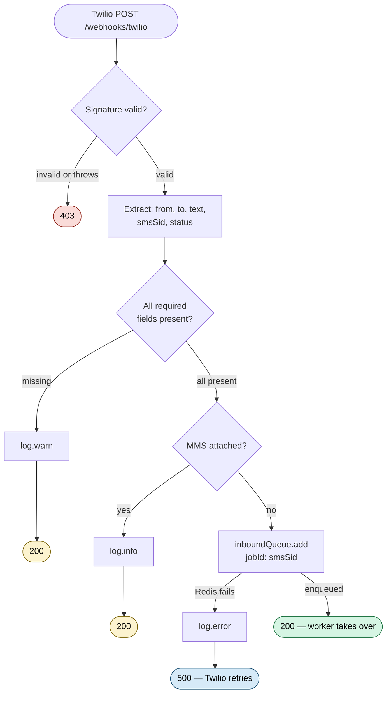
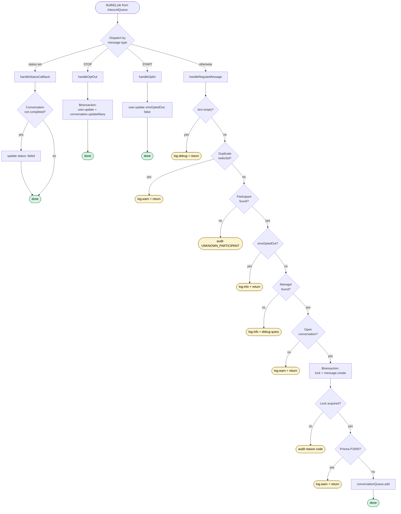

# Inbound Webhook Routing

> **Status:** planned for v1.2 — not yet implemented.
> **Plan reference:** see `version-1.2.md` Step 16 for commit boundaries and progress checkboxes.

Architecture and per-file specification for the Twilio inbound webhook pipeline.
Covers participant SMS replies, delivery status callbacks, and STOP/START opt-out
flows. Routes inbound traffic by `From` (participant phone) + `To` (manager's
assigned number) — no global fallback number.

---

## Architecture — two-queue async

The webhook handler returns 200 to Twilio immediately after persisting the raw
payload to Redis. All business logic — DB lookups, conversation locking, message
writes, downstream queue dispatch — runs in a BullMQ worker with retries.

```
Twilio → webhooks.ts → inboundQueue (Redis) → return 200
                              ↓
                     inbound.worker.ts
                       ├── handleStatusCallback
                       ├── handleOptOut        ($transaction)
                       ├── handleOptIn
                       └── handleRegularMessage → conversationQueue
                                                        ↓
                                               conversation.worker.ts
```

**Why two queues:**
- Twilio's webhook timeout is 15 seconds. Synchronous DB work risks hitting that under load or during DB blips.
- Redis write is sub-millisecond. Once the payload is in `inboundQueue`, the message cannot be lost — BullMQ retries handle every downstream failure.
- Workers can be scaled independently of the HTTP layer.
- Failed inbound jobs accumulate in BullMQ's `failed` state for manual inspection rather than vanishing.

---

### Detailed flow

The two-queue pipeline above breaks down into two flows — one per file. The
diagrams below trace the decision tree inside each.

#### HTTP edge — `webhooks.ts`



**Terminals:**
- **403** — invalid signature or unexpected SDK throw
- **200 (silent drop)** — missing fields or MMS; logged but discarded
- **200 (enqueued)** — happy path; worker takes over
- **500** — Redis unavailable; Twilio will retry the webhook

---

#### Worker — `inbound.worker.ts`



Top-level dispatch is a 4-way switch — status callback first (no text content),
STOP / START before routing, regular message last. The dense path is
`handleRegularMessage`, which performs an ordered lookup chain where each
step is a guard with its own outcome. See *Routing & lookup chain* under
Edge cases below for the rationale behind each step's order and the rule
that opt-out check (Step 2) must precede the open-conversation check (Step 4).

---

## Edge cases & decisions

Organized by where the resolution lives in the pipeline. Original case numbers
are preserved in parentheses for traceability — see the **Case index** at the
end of this section to look up by number.

---

### Cross-cutting principles

These rules apply wherever the relevant pattern appears — they are not tied to
a single handler.

**Audit log writes never crash the worker.** Wrap every `inboundAuditLog.create`
call in `.catch(err => log.warn(...))`. A failed log write must never stop
message processing or trigger BullMQ retries for a non-critical write.
*(Case 27)*

**Audit log records the destination number.** `InboundAuditLog` includes
`toPhone String? @map("to_phone")`. Pass `to` in every `inboundAuditLog.create`
call in the worker. Without it, you cannot tell which manager's number a lost
reply was sent to. Historical records without the field remain as-is.
*(Case 22)*

---

### Route-level guards (in `webhooks.ts`)

Fail fast at the HTTP edge. Each guard returns 200 (or 403 for signature) and
the request never reaches the worker.

| Concern | Resolution |
|---|---|
| **Signature validation throws** *(Case 23)* | Wrap `validateWebhookSignature` in try/catch → return 403 on any throw. Both invalid signature and unexpected SDK throw return 403 — same outcome, one block |
| **Missing required fields** *(Cases 6, 16, 17)* | Single guard `if (!from \|\| !to \|\| !smsSid)` → `req.log.warn({ from, to, smsSid }, '[webhook] missing required fields')` + return 200 before Redis write. Covers `To`, `From`, and `SmsSid`/`MessageSid` independently |
| **Status callback with missing SID** *(Case 25)* | Same guard above — `smsSid = raw.MessageSid ?? raw.SmsSid ?? ''` falls into the `!smsSid` check and never reaches `handleStatusCallback`. Without this guard, Prisma throws on `findUnique({ where: { twilioSid: undefined } })` |
| **MMS / multimedia messages** *(Case 26)* | MMS rejected — this webhook handles SMS only. Guard before enqueue: `if (parseInt(raw.NumMedia ?? '0') > 0)` → `log.info` + return 200. Dropped before Redis write |
| **Webhook rate-limited by global `@fastify/rate-limit`** *(Case 14)* | Set `config: { rateLimit: false }` on the route — global rate limit (`global: true`) otherwise applies. Signature validation already filters non-Twilio requests — no abuse risk from exempting |

---

### Worker idempotency & error recovery (in `inbound.worker.ts`)

How the worker survives Twilio retries, DB blips, and malformed payloads.

| Concern | Resolution |
|---|---|
| **Duplicate Twilio SID** *(Case 1)* | `prisma.message.findUnique({ where: { twilioSid: smsSid } })` — if found, `req.log.warn({ smsSid, from, to }, '[webhook] duplicate Twilio SID — already processed')` then return. **Layer 2** of two-layer idempotency (Layer 1 is `jobId: smsSid` in BullMQ — see [Idempotency](#idempotency--two-layers)) |
| **Transient DB error** *(Case 10)* | Handled by BullMQ retry policy. Webhook already returned 200 — DB work happens in the worker. If the worker throws, BullMQ retries with backoff (see [BullMQ retry policy](#bullmq-retry-policy)). `withRetry` no longer needed in the webhook handler |
| **Conversation stuck in `processing` after partial failure** *(Case 13)* | Without protection: lock set → `message.create` fails → worker throws → BullMQ retries → conversation already `processing` → lock fails → message lost. Fix: wrap lock + `message.create` in a `$transaction`. If `message.create` fails → lock rolls back → conversation stays `awaiting_reply` → BullMQ retries from a clean slate |
| **Message body too long for DB column** *(Case 18)* | Concatenated SMS can be ~1600 chars; `message.create` throws Prisma `P2000`. In the worker: catch `P2000` → `log.warn` + return without rethrowing → BullMQ marks job complete, no retry. *Future:* truncate or store overflow separately |
| **Whitespace-only body** *(Case 21)* | After `text.trim()`, guard `if (!text)` before the lock → `log.debug({ from, to, smsSid }, '[webhook] empty body — discarded')` + return. No audit log. Passing empty text through would trigger the AI with no input |

---

### Routing & lookup chain (in `handleRegularMessage`)

Lookup steps in the order the worker performs them. Each step has a specific
failure mode and a specific resolution. Order matters — Step 2 must precede
Step 4 so opted-out replies are logged with the correct reason.

**Step 1 — Find participant by `from`** *(Case 4)*
- `prisma.user.findFirst({ where: { phone: from, deletedAt: null } })` returns null
- → audit log with reason `UNKNOWN_PARTICIPANT` (include `fromPhone` + `toPhone`)
- → return 200. Permanent failure — Twilio must not retry

**Step 2 — Check `smsOptedOut`** *(Case 12)*
- Twilio already auto-replies "You have opted out. Reply START to resubscribe." — we cannot send our own reply (outbound blocked)
- `log.info({ from, to }, '[webhook] message from opted-out participant — handled by Twilio auto-reply')` + return
- Must run before Step 4 so the log shows the correct reason

**Step 3 — Find manager by `to`** *(Cases 7, 8)*
- Single query `{ assignedPhone: to, role: 'manager', deletedAt: null }` → null → `req.log.info` + return 200
- Covers Case 8 (demoted / soft-deleted manager whose number is still live in Twilio) for free — `role` and `deletedAt` filters exclude them
- In debug mode only: a second query identifies which condition failed (number not in system / soft-deleted / demoted), each logged separately at `req.log.debug`. Extra query gated by `req.log.isLevelEnabled('debug')` — zero cost in production

**Step 4 — Find open conversation** *(Case 5)*

`Conversation` has no direct `managerId` field — manager is reached via the nested relation `broadcast.schedule.managerId`. Existing indexes cover the join (`schedules.manager_id`, `broadcasts.schedule_id` FK, `conversations.[userId, status]`).

```ts
const conversation = await prisma.conversation.findFirst({
  where: {
    userId:    participant.id,
    broadcast: { schedule: { managerId: manager.id } },
    status:    { notIn: TERMINAL_STATUSES },
  },
  orderBy: { startedAt: 'desc' },
})
```

- → null: `req.log.warn({ from, to }, '[webhook] no open conversation for participant')` + return. No audit log entry
- `orderBy startedAt desc` selects the most recent if (unexpectedly) multiple open conversations exist with the same manager

**Cases that fall through to Step 4 by design:**
- **Participant texts the wrong manager's number** *(Case 9)* — theoretical in normal usage; phones reply to the number that sent the message. Only possible via manual composition or number recycling. `managerId` filter routes the conversation lookup → no match → Step 4 path
- **Phone number recycled mid-conversation** *(Case 20)* — Manager A demoted, number reassigned to Manager B; participant replies. Manager lookup succeeds (finds B), conversation lookup with `managerId: B` finds nothing (participant has no open thread with B) → Step 4 path. Manager A's conversation already soft-deleted on demotion. Acceptable by design — documented known behavior

**Works correctly without special handling:**
- **Two open conversations with two different managers** *(Case 11)* — normal production scenario. Participant receives broadcasts from two managers; each reply goes to the number it came from (phone routing). `managerId` filter isolates each thread → no cross-routing possible

---

### Special handlers

#### STOP / START — global opt-out *(Cases 2, 29)*

**Scope:** global opt-out — any STOP from any manager number opts the participant out of the entire platform. Per-number opt-out deferred to v2 (see `version-2.md`).

**Keyword sets** (aligned with Twilio's documented set for US long-codes):

```ts
const OPT_OUT_KEYWORDS = new Set([
  'STOP', 'STOPALL', 'UNSUBSCRIBE', 'CANCEL', 'END', 'QUIT',
])
const OPT_IN_KEYWORDS = new Set([
  'START', 'YES', 'UNSTOP',
])

const isOptOut = (text: string) => OPT_OUT_KEYWORDS.has(text.trim().toUpperCase())
const isOptIn  = (text: string) => OPT_IN_KEYWORDS.has(text.trim().toUpperCase())
```

**Match rule:** exact match on trimmed + uppercased text. `"STOP"` triggers; `"please stop"` does not.

**HELP / INFO:** not handled — processed as regular SMS. Configure Twilio's per-number Auto-Response in the console for help text if needed.

**Localization:** English-only assumed. Multi-language opt-out keywords (e.g., French `ARRÊT`) deferred.

**`handleOptOut` algorithm:**

```ts
async function handleOptOut(args: {
  from: string
  prisma: PrismaClient
  log: Logger
}) {
  const { from, prisma, log } = args

  const user = await prisma.user.findFirst({
    where:  { phone: from, deletedAt: null },
    select: { id: true },
  })
  if (!user) {
    log.info({ from }, '[webhook] opt-out from unknown number — ignored')
    return
  }

  await prisma.$transaction([
    prisma.user.update({
      where: { id: user.id },
      data:  { smsOptedOut: true },
    }),
    prisma.conversation.updateMany({
      where: {
        userId: user.id,
        status: { notIn: TERMINAL_STATUSES },
      },
      data: {
        status:     'failed',
        failedAt:   new Date(),
        failReason: 'OPT_OUT',
      },
    }),
  ])

  log.info({ from, userId: user.id }, '[webhook] participant opted out')
}
```

**Atomicity (Case 29):** `$transaction` array form makes both ops succeed-or-rollback together. Without this, a failed `updateMany` would leave the participant opted out while active conversations remain open and workers keep sending.

**`handleOptIn` algorithm:** mirror image — `findFirst` user, `update` `smsOptedOut: false`, log info. Silent return if user not found.

#### Out-of-turn reply — conversation locking *(Case 3)*

**Constants** (defined at top of `inbound.worker.ts`):

```ts
const TERMINAL_STATUSES = [
  'completed', 'failed', 'timed_out', 'superseded',
] as const

const REASON_BY_STATUS = {
  processing:  'OUT_OF_TURN',
  completed:   'SESSION_COMPLETED',
  timed_out:   'SESSION_TIMED_OUT',
  superseded:  'SESSION_SUPERSEDED',
  failed:      'SESSION_FAILED',
} as const
```

**Lock mechanism:** atomic `updateMany` succeeds only if `status === 'awaiting_reply'`. Wrapped in `$transaction` with `message.create` so a failed write rolls back the lock (Case 13).

**On lock fail (`count === 0`):** read the current conversation status inside the transaction, return discriminated `{ locked: false, currentStatus }`. Outside the transaction, write to `inboundAuditLog` with `REASON_BY_STATUS[currentStatus]`. Audit log write wrapped in `.catch()` (cross-cutting principle, Case 27).

**Reason codes** — each terminal/in-flight status maps to one:

| Status | Reason code |
|---|---|
| `processing` | `OUT_OF_TURN` |
| `completed` | `SESSION_COMPLETED` |
| `failed` | `SESSION_FAILED` |
| `timed_out` | `SESSION_TIMED_OUT` |
| `superseded` | `SESSION_SUPERSEDED` |

**Forward-looking note:** `SESSION_COMPLETED` is a signal for the future participant-initiated conversation re-open flow (see `version-2.md`).

**Why discriminated return, not sentinel error:** lock-not-acquired is an *expected* outcome of normal status transitions, not exceptional. Using a return value keeps `try/catch` reserved for actual errors (P2000, DB failures). Discriminated unions (`{ locked: true } | { locked: false; currentStatus }`) give compile-time exhaustiveness checking.

#### Status callback — `handleStatusCallback` *(Case 28)*

```ts
async function handleStatusCallback(args: {
  smsSid: string
  status: string
  prisma: PrismaClient
  log: Logger
}) {
  const { smsSid, status, prisma, log } = args

  // Only act on hard failures
  if (status !== 'failed' && status !== 'undelivered') return

  // Find the outbound message this callback refers to
  const message = await prisma.message.findUnique({
    where:  { twilioSid: smsSid },
    select: { conversationId: true },
  })
  if (!message) return  // unknown message — silent

  // Mark conversation failed; Case 28 guard prevents overwriting completed
  await prisma.conversation.updateMany({
    where: {
      id:     message.conversationId,
      status: { notIn: ['completed'] },
    },
    data: {
      status:     'failed',
      failedAt:   new Date(),
      failReason: 'TWILIO_DELIVERY_FAILED',
    },
  })

  log.info(
    { smsSid, status, conversationId: message.conversationId },
    '[webhook] outbound delivery failed — conversation marked failed'
  )
}
```

**Status filter:** only `failed` + `undelivered` trigger action. All other statuses (`queued`, `sending`, `sent`, `delivered`, `read`) → no-op.

**`failReason`:** generic `'TWILIO_DELIVERY_FAILED'` — same string for both failure types. Future work: parse Twilio's `ErrorCode` field for granular reasons (e.g., `INVALID_NUMBER`, `CARRIER_BLOCKED`).

**Message not found:** silent return — nothing actionable when the message we'd update doesn't exist (cleaned up, pre-migration, etc.).

**Case 28 guard:** `status: { notIn: ['completed'] }` prevents overwriting a completed conversation with a late-arriving failure callback.

**Signature:** `(smsSid, status)` only — never `from` / `to`. Status callbacks reverse those fields (`From` = manager, `To` = participant), unrelated to inbound routing.

---

### Non-issues / superseded

| # | Case | Why no code is needed |
|---|---|---|
| 15 | **`parseInboundWebhook` must be called first** | Superseded by the two-queue architecture. Route handler extracts fields directly from raw body (`raw.From`, `raw.To` etc.) and enqueues `{ from, to, text, smsSid, status }`. Worker receives already-clean fields — `parseInboundWebhook` no longer needed in the webhook path |
| 24 | **Pre-migration replies** | N/A. First deployment — no old global number ever existed |

---

### Deferred to v2

See `version-2.md` § *Deferred from Step 16 — Webhook Routing* for:
- Per-number opt-out (currently global STOP)
- Participant-initiated conversation creation (Case 5 future hook)
- Redis-down stuck conversation cleanup job

---

### Case index

For looking up a case by its original number.

| # | Where it lives now |
|---|---|
| 1 | Worker idempotency & error recovery — Duplicate Twilio SID |
| 2 | Special handlers — STOP / START |
| 3 | Special handlers — Out-of-turn reply |
| 4 | Routing & lookup chain — Step 1 (participant) |
| 5 | Routing & lookup chain — Step 4 (open conversation) |
| 6 | Route-level guards — Missing required fields |
| 7 | Routing & lookup chain — Step 3 (manager) |
| 8 | Routing & lookup chain — Step 3 (covered by Case 7's filters) |
| 9 | Routing & lookup chain — falls through to Step 4 |
| 10 | Worker idempotency & error recovery — Transient DB error |
| 11 | Routing & lookup chain — works correctly without special handling |
| 12 | Routing & lookup chain — Step 2 (smsOptedOut check) |
| 13 | Worker idempotency & error recovery — Stuck in `processing` |
| 14 | Route-level guards — Rate-limit exemption |
| 15 | Non-issues / superseded |
| 16 | Route-level guards — Missing required fields (folded into Case 6) |
| 17 | Route-level guards — Missing required fields (folded into Case 6) |
| 18 | Worker idempotency & error recovery — Body too long (P2000) |
| 20 | Routing & lookup chain — falls through to Step 4 |
| 21 | Worker idempotency & error recovery — Whitespace-only body |
| 22 | Cross-cutting principles — `toPhone` in audit log |
| 23 | Route-level guards — Signature validation throws |
| 24 | Non-issues / superseded |
| 25 | Route-level guards — Missing required fields (folded into Case 6's guard) |
| 26 | Route-level guards — MMS rejection |
| 27 | Cross-cutting principles — Audit log write resilience |
| 28 | Special handlers — Status callback completed-conversation guard |
| 29 | Special handlers — STOP atomicity |

---

## File specification

### `backend/src/routes/webhooks.ts` — thin gate

Validate signature, extract fields, enqueue, return 200. Zero business logic.

Route is registered with `config: { rateLimit: false }` (Case 14 — exempt from
global `@fastify/rate-limit`).

```ts
// 1. Signature validation — same outcome for invalid + unexpected throw
try {
  if (!smsProvider.validateWebhookSignature(req)) return reply.status(403).send()
} catch { return reply.status(403).send() }

// 2. Extract fields
const raw    = req.body as Record<string, string>
const from   = raw.From           ?? ''
const to     = raw.To             ?? ''
const text   = (raw.Body ?? '').trim()
const smsSid = raw.MessageSid ?? raw.SmsSid ?? ''
const status = raw.MessageStatus  ?? ''

// 3. Guards (Cases 6, 16, 17, 25)
if (!from || !to || !smsSid) {
  req.log.warn({ from, to, smsSid }, '[webhook] missing required fields')
  return reply.status(200).send()
}

// 4. MMS guard (Case 26)
if (parseInt(raw.NumMedia ?? '0') > 0) {
  req.log.info({ from, to, smsSid }, '[webhook] MMS rejected — SMS only')
  return reply.status(200).send()
}

// 5. Enqueue + return
try {
  await inboundQueue.add('inbound', { from, to, text, smsSid, status }, { jobId: smsSid })
} catch (err) {
  req.log.error({ err }, '[webhook] Redis unavailable — enqueue failed')
  return reply.status(500).send()  // Twilio retries
}
return reply.status(200).send()
```

### `backend/src/jobs/inbound.worker.ts` *(new)* — business logic

Single file (~350 LOC) with `// ─── Section ───` comments matching `webhooks.ts` style. Promote to a folder split only if it grows past ~600 LOC.

**File structure:**

```
─── Imports
─── Constants (TERMINAL_STATUSES, OPT_OUT_KEYWORDS, OPT_IN_KEYWORDS, REASON_BY_STATUS)
─── Types (InboundJob)
─── Helpers (isOptOut, isOptIn, safeAuditLog)
─── Handler: handleStatusCallback
─── Handler: handleOptOut
─── Handler: handleOptIn
─── Handler: handleRegularMessage
─── Worker factory + dispatch (startInboundWorker)
```

**Handler signatures** — each handler takes a per-handler args object containing only what it needs. No shared mega-context — keeps signatures honest and gives compile-time safety on missing fields:

```ts
async function handleStatusCallback(args: {
  smsSid: string; status: string;
  prisma: PrismaClient; log: Logger;
}) { ... }

async function handleOptOut(args: {
  from: string;
  prisma: PrismaClient; log: Logger;
}) { ... }

async function handleOptIn(args: {
  from: string;
  prisma: PrismaClient; log: Logger;
}) { ... }

async function handleRegularMessage(args: {
  from: string; to: string; text: string; smsSid: string;
  prisma: PrismaClient; log: Logger;
}) { ... }
```

**Worker concurrency** — env-driven via `INBOUND_WORKER_CONCURRENCY` (default `5`, range 1–50):

```ts
new Worker('inbound', processFn, {
  connection:  redis,
  concurrency: config.inboundWorker.concurrency,
})
```

Concurrency > 1 is safe because per-conversation atomicity is enforced by the `$transaction` lock in `handleRegularMessage`. Set to `1` in `.env.local` for sequential dev debugging.

**`handleRegularMessage` flow (pseudocode):**

```
1. Guard !text → log.debug + return                                    (Case 21)
2. message.findUnique(smsSid) → if found: log.warn + return            (Case 1, Layer 2)
3. findFirst participant { phone: from, deletedAt: null }
   → null: auditLog({ fromPhone, toPhone, UNKNOWN_PARTICIPANT }) + return  (Case 4)
4. if participant.smsOptedOut: log.info + return                       (Case 12)
5. findFirst manager { assignedPhone: to, role: manager, deletedAt: null }
   → null: log.info + debug query + return                             (Case 7)
6. findFirst conversation:
     where: { userId, broadcast: { schedule: { managerId } }, status: { notIn: TERMINAL_STATUSES } }
     orderBy: { startedAt: 'desc' }
   → null: log.warn + return                                           (Case 5)
7. $transaction (callback form):
     lock = updateMany conversation { id, status: awaiting_reply } → processing
     if (lock.count === 0):
       current = findUnique conversation { id } select status
       return { locked: false, currentStatus: current.status }
     message.create({ conversationId, role: participant, body: text, twilioSid })
     return { locked: true }
   catch P2000 outside: log.warn + return                              (Case 18)
   if (!result.locked): auditLog({ reason: REASON_BY_STATUS[currentStatus] }) + return  (Case 3)
8. conversationQueue.add(conversationId)                               (known gap — Redis-down stuck conversation deferred to v2)

All auditLog.create calls wrapped in .catch(log.warn)                  (Case 27)
```

**Discriminated return from `$transaction`** (not sentinel error) — keeps `try/catch` reserved for actual errors. Lock-not-acquired is an expected outcome of normal status transitions, communicated via return value. See *Special handlers § Out-of-turn* for the rationale.

### `backend/src/jobs/queue.ts` — queue declaration

Add `inboundQueue` alongside `conversationQueue`:

```ts
removeOnComplete: { count: 200 }
removeOnFail:     { count: 500 }
```

Matches existing queue settings.

### `backend/src/index.ts` — worker registration

Register `startInboundWorker()` alongside existing workers, guarded by Twilio
configured (same guard as `conversationWorker`).

### Shared `InboundJob` type

Defined in `inbound.worker.ts`, imported in `webhooks.ts`:

```ts
export type InboundJob = {
  from:   string   // participant's phone (E.164)
  to:     string   // manager's assignedPhone (E.164)
  text:   string   // trimmed body — empty for status callbacks
  smsSid: string   // Twilio SID — used as BullMQ jobId for deduplication
  status: string   // non-empty = status callback, empty = inbound SMS
}
```

---

## Idempotency — two layers

| Layer | Mechanism | Catches |
|---|---|---|
| **1** | `jobId: smsSid` on `inboundQueue.add()` | Quick Twilio retries while the job is still in the queue (waiting/active). Fast Redis lookup, zero DB cost |
| **2** | `message.findUnique({ twilioSid: smsSid })` in worker | Delayed Twilio retries that arrive after the job already completed and was cleared from BullMQ. Once a job is gone from the queue, its jobId is no longer protected — the DB check is the final safety net |

---

## BullMQ retry policy

```ts
attempts: 5
backoff:  { type: 'exponential', delay: 1000 }
```

Retries fire at 1s, 2s, 4s, 8s, 16s — ~31 seconds of recovery window. After 5
failures, the job moves to `failed` state for manual inspection in Bull Board.

---

## Handler dispatch order

```ts
if (status)          return handleStatusCallback(smsSid, status)
if (isOptOut(text))  return handleOptOut(from)
if (isOptIn(text))   return handleOptIn(from)
return handleRegularMessage(from, to, text, smsSid, log)
```

Status callbacks first (no text content). STOP/START before routing. Regular
message last.

---

## End-to-end test plan

Requires a publicly reachable webhook URL (ngrok or deployed env).

**Happy path — known participant, known manager number:**
- Send a real SMS from your phone to the manager's provisioned number
- [ ] New inbound message record created in DB, linked to the correct conversation
- [ ] Message body matches what you sent
- [ ] 200 returned to Twilio (check Twilio delivery logs)

**Two managers, same participant:**
- Two managers each have their own provisioned number
- Participant texts Manager A's number → routes to Manager A's conversation
- Participant texts Manager B's number → routes to Manager B's conversation
- [ ] No cross-routing

**Unknown participant (permanent failure):**
- Send SMS from an unregistered phone number
- [ ] 200 returned (Twilio does not retry)
- [ ] Warning logged: `"Inbound SMS from unknown participant"`

**Unknown manager number (permanent failure):**
- POST to `/webhooks/twilio` with a `To` that matches no manager
- [ ] 200 returned
- [ ] Warning logged: `"Inbound SMS to unknown manager number"`

**Transient DB error (BullMQ retries):**
- Simulate DB failure while inbound worker is processing
- [ ] Webhook always returns 200 — Twilio never retries
- [ ] BullMQ retries worker job up to 5 times with exponential backoff
- [ ] After 5 failures: job moves to `failed` state — visible in Bull Board
