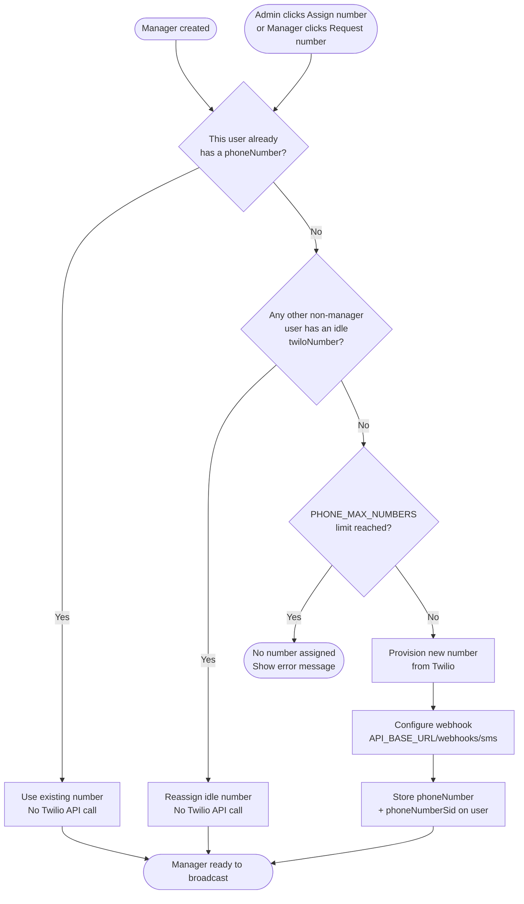

# Per-Manager Phone Numbers

Each manager gets their own dedicated phone number. Two fields are stored on the user record:

- `phoneNumber` — the E.164 phone number (e.g. `+12025551234`), used as the `From` on outbound SMS
- `phoneNumberSid` — the provider's unique ID for this number, stored so it can be released via the API if needed in the future (cleanup job, manual release). Each SMS provider uses its own format for this ID.

Inbound replies are routed using two webhook fields together:

- `To` — the manager's dedicated number (identifies the manager)
- `From` — the participant's phone (identifies the participant)

Together they uniquely identify the conversation, regardless of how many managers are texting the
same participant simultaneously.

---

## Provisioning Strategy

### When a number is assigned

A number is assigned in two ways — both run the same 3-step provisioning logic:

1. **At creation time (automatic):** when a manager is created, provisioning runs immediately. The number is visible in the admin UI before the first broadcast fires.
2. **On demand (manual):** if provisioning failed at creation or the limit was reached, both the admin and the manager can trigger provisioning via a button in the dashboard. Goes through automatically — no approval needed.

### Number type and country

Numbers are provisioned as local phone numbers. Country and type are configurable:

- `PHONE_NUMBER_COUNTRY` — default `US`
- `PHONE_NUMBER_TYPE` — default `local`

The webhook URL configured on the provisioned number is built from the existing `API_BASE_URL`
environment variable: `{API_BASE_URL}/webhooks/sms`

### The 3-step provisioning order

Before buying a new number from Twilio, the system checks for idle numbers that can be recycled:

1. **Does this user already have a `phoneNumber`?** → use it directly, no Twilio API call
2. **Does any other non-manager user have an idle `phoneNumber`?** → reassign it, no Twilio API call
3. **Provision a new number from Twilio** → but only if the purchase limit has not been reached (see Purchase Limit below)

Step 1 handles role-churn: if an admin promotes → demotes → promotes the same user repeatedly,
that user always reclaims their own number. It is never accidentally given to someone else.

Step 2 handles recycling: demoted or soft-deleted managers leave their numbers on their records.
Those numbers are reused by the next manager that needs one — no money wasted.

### Purchase limit

The system enforces a maximum number of Twilio numbers that can be purchased. This is a safety
ceiling that prevents runaway costs from bugs or unexpected provisioning loops.

**Stored as:** `PHONE_MAX_NUMBERS` environment variable (default: 50 if not set)

**How it works:** Before Step 3 (purchasing a new number), the system counts how many `phoneNumber`
values exist across all users (active and soft-deleted). If that count is at or above the limit,
provisioning is skipped — the manager is created without a number and is blocked from broadcasting
until an idle number becomes recyclable or the limit is raised.

Steps 1 and 2 (recycling) are always allowed — the limit only gates new purchases from Twilio.

---

### Numbers are never proactively released

Numbers are never deleted from Twilio automatically. They stay on the user record across all
lifecycle events:

| Event | What happens to the number |
|---|---|
| Manager role removed | Number stays on the user record — eligible for recycling |
| User soft-deleted | Number stays on the soft-deleted record — eligible for recycling |
| Manager re-promoted | Reclaims their own number (Step 1) |
| New manager created | Recycles an idle number if available (Step 2), or buys new (Step 3) |

This means the total number of Twilio numbers in the account grows slowly and plateaus — it never
exceeds the peak number of distinct managers who have ever sent a broadcast.

Idle numbers cost ~$1/month each. For small-to-medium teams this is negligible. At scale, a
periodic cleanup job can release numbers that have been idle for more than N days.

---

## Broadcast Guard

A manager without a dedicated `phoneNumber` cannot send or schedule a broadcast.

**Backend:** the broadcast service rejects the request with a clear error if the firing manager
has no `phoneNumber`.

**Frontend:** the "Send now" and "Schedule" buttons are disabled when the logged-in manager has
no `phoneNumber`. A message is shown explaining why, alongside the "Request phone number" button
(see Dashboard UI below).

---

## Dashboard UI

The phone number state is surfaced in both the admin dashboard and the manager's own dashboard.
Both use the same backend endpoint and the same provisioning logic.

### Admin dashboard (users table)

| Manager state | What admin sees |
|---|---|
| Has `phoneNumber` | Phone number displayed in the user row |
| No `phoneNumber` | "Assign number" button in the user row |

Clicking "Assign number" calls `POST /users/:id/provision-number` immediately — no confirmation
step. The button is replaced by the provisioned number on success, or an error message if the
limit is reached and no idle numbers are available.

### Manager dashboard

| Manager state | What manager sees |
|---|---|
| Has `phoneNumber` | Their phone number shown in the workspace header or profile area |
| No `phoneNumber` | Blocked message + "Request phone number" button |

Clicking "Request phone number" calls `POST /users/me/provision-number` immediately — goes
through automatically, no admin approval needed. Same 3-step provisioning logic runs.

### On-demand provisioning endpoint

`POST /users/:id/provision-number`

- Admin can call it for any manager
- Manager can call it only for themselves (`/users/me/provision-number`)
- Runs the same 3-step provisioning order as creation-time provisioning
- Returns the assigned number on success
- Returns a clear error if `PHONE_MAX_NUMBERS` is reached and no idle numbers are available

---

## No Global Number

`TWILIO_FROM_NUMBER` is removed from config entirely. Every outbound SMS must use the manager's
own `phoneNumber`. There is no shared fallback number.

| Manager state | Outbound | Inbound |
|---|---|---|
| Has `phoneNumber` | Sends from manager's number | Routed by `To` + `From` |
| No `phoneNumber` | Blocked by Broadcast Guard | — |

---

## Inbound Routing

When a participant replies, Twilio sends a webhook with `From` (participant's phone) and `To`
(the number they replied to — the manager's number).

The routing logic:

1. Find the participant by `From`
2. Find the manager by `To` — look up which manager owns that number
3. Find the open conversation scoped to that participant **and** that manager

### Webhook response strategy

Twilio retries the webhook when it receives a `5xx` response, and stops retrying on `2xx`.
The response code must reflect the actual nature of the failure:

| Situation | Response | Why |
|---|---|---|
| Server error (DB failure, network issue) | `500` after internal retries | Transient — Twilio retry may succeed once server recovers |
| No manager found for `To` | `200` + log | Permanent — retrying will never make the manager appear |
| Participant not found | `200` + log | Permanent — retrying will never help |

### Internal retry on server errors

Before returning `500`, the webhook retries the failed operation internally N times with a short
delay. Only if all internal retries fail does it return `500` to Twilio.

**Stored as:** `WEBHOOK_RETRY_ATTEMPTS` environment variable (default: 2 if not set)

This means a transient DB blip gets up to N server-side retries before Twilio is even notified.
If the server fully recovers within those retries, Twilio never sees a failure at all.

---

## Error Handling

| Situation | Behavior |
|---|---|
| Provisioning fails at manager creation | Log warning, continue — manager created without a number, blocked from broadcasting until resolved |
| No Twilio numbers available to provision | Same as above |
| `PHONE_MAX_NUMBERS` limit reached with no idle numbers | Manager is blocked from broadcasting — admin must raise the limit or a number must become idle for recycling |
| Number released manually in Twilio console but still in DB | Step 1 finds the number and uses it, but Twilio rejects the send — DB and Twilio are out of sync. Resolved by clearing `phoneNumber` directly in the DB |
| Inbound to a soft-deleted manager's number | No active manager found → `200` + log (permanent, no retry) |
| DB failure during webhook routing | Retry internally up to `WEBHOOK_RETRY_ATTEMPTS` times → `500` if all fail → Twilio retries |

---

## Existing Managers

Managers created before this feature was deployed have no `phoneNumber` and are blocked from
broadcasting by the Broadcast Guard. They will see the "Request phone number" button in their
dashboard and can provision a number themselves immediately — or the admin can assign one from
the admin dashboard. No manual DB work needed.

---

## Cost Model

- Cost is proportional to the number of managers who have **ever been assigned a number**
- Managers created but whose provisioning failed cost nothing
- Recycling means the number of Twilio numbers in the account never exceeds peak active managers
- Role-churn (add/remove manager repeatedly for the same user) costs nothing after the first provision
- `PHONE_MAX_NUMBERS` caps the total Twilio spend ceiling — defaults to 50
