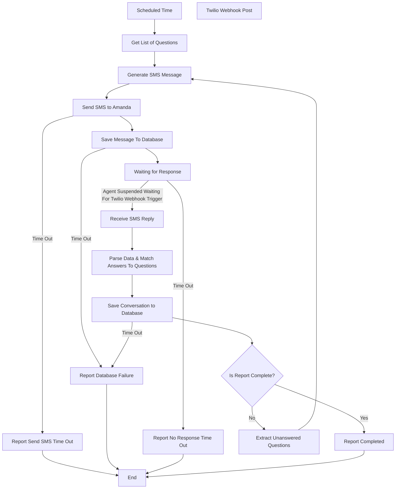

# AmandaAI Project:

## Short description:
AI-powered system for managing daily, weekly, monthly, and annual reports via SMS communication.

The system sends Amanda an SMS requesting a report.
She responds via SMS, and the system continues the conversation until all required information is collected.

Once the report is completed, the full conversation is stored in the database for tracking and auditing purposes.

**Workflow Notes:**
1. The AI agent will generate new message from the question's list.
2. Amanda will answers general text
3. An AI agent will analyze the message received from Amanda and decide which questions from the list of questions have an answer.
4. If all questions are answered, the process is complete. If not, the process will start over with the unanswered questions.
5. The session will be saved in the database until the process is complete or until the scheduled time for sending a new message through the agent arrives again.
6. The system supported only Single-user and not a multi-tenant system
7. Questions that are not sure if they were answered are marked as unanswered.
8. All nodes have retry policies configured at the LangGraph level. After max retries, failure paths are taken.
9. Twilio MessageSid deduplication before graph refresh
10. Twilio Webhook Signature Validation endpoint must validate the X-Twilio-Signature header

**Build App notes:**
1. Logging
2. Session management
3. Database managment
4. Correct architecture for langgraph
5. Easy to maintenance
6. MCP server managment easy add tools in future
7. Good and Correct APIs
8. Retry policy for langgraph, database write failure.
9. All report and Database Failure will report to admin via email

## Diagram:

## Components:
#### 1. Backend:
- Manages workflow execution and state (AI orchestration engine)
- Handles SMS sending and receiving
- Processes and extracts structured data from messages
- Integrates with database and external services

##### Tech Stack:
- API Framework: FastAPI
- AI Orchestration: LangGraph, LangSmith
- Database: PostgreSQL
- SMS Provider: Twilio
- LLM Provider: OpenAI / Anthropic / etc.
- Scheduler: APScheduler or Celery Beat (for the scheduled trigger)
- Checkpointer: LangGraph  PostgresSaver (enables interrupt/resume across restarts)
- FastMCP - managed MCP server to easy add tools in future

**Notes:**
1. Implemented via Python abstract base classes (ABC). Each provider has a concrete implementation. Switching providers requires only changing the injected class - no business logic changes." This tells a developer exactly the pattern to use.

##### Supported Sessions:
- Scheduled - APScheduler creates the next run
- Active - get_questions starts
- Waiting_reply - save_message_db succeeds
- Processing - receive_sms fires or when report is incomplete and a follow-up SMS is generated.
- Completed - session_completed reached
- Timed_out - report_no_response reached
- Failed - Any report_* failure node reached

**Notes:**
1. If Amanda hasn't finished responding to the previous session and the next scheduled arrived, the previous session will closed with Time Out.

#### 2. Database:
- Stores question templates.
- Stores user profiles (name, phone, etc.)
- Stores full conversation history and reports
#### 3. frontend:
- Manage question templates (Add / Edit / Delete)
- View conversations history
- Monitor report status