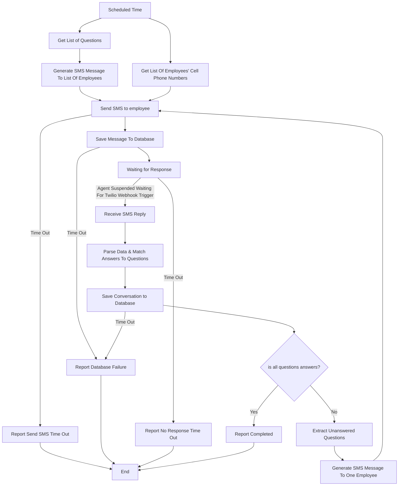

# Report Project:

## Short description:
AI-powered system for managing employees reports via SMS communication.

The system sends to list of employees' cell phone numbers in parallel an SMS requesting a report.
employee will responds via SMS, and the system continues the conversations with each employee separately until all required information from the employee is collected.

Once all questions answered, the full conversation is stored in the database for tracking and auditing purposes.

**Workflow Notes:**
1. The AI agent will generate new message from the question's list.
2. Send the Message to list of employees' cell phone numbers
3. The proccess from **send_sms_to_employee** to **end_node** runs in parallel for each employee separately, with separate session.
4. employee will answers general text.
5. An AI agent will analyze the message received from employee and decide which questions from the list of questions have an answer.
6. If all questions are answered, the process is complete. If not, the process will start over with the unanswered questions.
7. The session will be saved in the database until the process is completed or until the scheduled time for sending a new message through the agent arrives again.
8. The system supported only Single-user and not a multi-tenant system
9. Questions that are not sure if they were answered are marked as unanswered.
10. All nodes have retry policies configured at the LangGraph level. After max retries, failure paths are taken.
11. Twilio MessageSid deduplication before graph refresh
12. Twilio Webhook Signature Validation endpoint must validate the X-Twilio-Signature header

**Build App notes:**
1. Logging
2. Session management
3. Database managment
4. Correct architecture for langgraph
5. Easy to maintenance
6. MCP server managment easy add tools in future
7. Good and Correct APIs
8. Retry policy for langgraph, database write failure.
9. All report and Database Failure will report to admin via email

## Diagram:

## Components:
#### 1. Backend:
- Manages workflow execution and state (AI orchestration engine)
- Handles SMS sending and receiving
- Processes and extracts structured data from messages
- Integrates with database and external services

##### Tech Stack:
- API Framework: FastAPI
- AI Orchestration: LangGraph, LangSmith
- Database: PostgreSQL
- SMS Provider: Twilio
- LLM Provider: OpenAI / Anthropic / etc.
- Scheduler: APScheduler or Celery Beat (for the scheduled trigger)
- Checkpointer: LangGraph  PostgresSaver (enables interrupt/resume across restarts)
- FastMCP - managed MCP server to easy add tools in future

##### Packages:
- Graph (langgraph)
- MCP server
  * Architecture
  * Tools
- Settings
  * Logging
  * Configs - Central configuration loaded from environment variables
  * Store - in-memory stores shared across the API server and the LangGraph workflow
##### APIs:
- POST:
  * create_session
  * add_question
  * remove_questions
  * send_question - Send now not on schedule
  * add_phone_number
  * remove_phone_number

- GET:
  * get_session
  * list_questions
  * get_next_schedule
  * list_phone_numbers
  * get_phone_number
  * get_report_by_phone_number - get all report related to phone number
  * get_report_by_time - get all report for a specific time

- PUT:
  * schedule_time
  * edit_question
  * edit_phone_number

**Notes:**
1. (Optional )Implemented via Python abstract base classes (ABC). Each provider has a concrete implementation. Switching providers requires only changing the injected class - no business logic changes." This tells a developer exactly the pattern to use. 
2. Two Cases 
***a.*** scheduled time the message will be sent to all employees' cell phones
***b.*** no message complete_report -> send_sms_to_employee the message will be sent only to a specific employee's cell phone number

##### Supported Sessions:
- Scheduled - APScheduler creates the next run
- Active - get_questions starts
- Waiting_reply - save_message_db succeeds
- Processing - receive_sms fires or when report is incomplete and a follow-up SMS is generated.
- Completed - session_completed reached
- Timed_out - report_no_response reached
- Failed - Any report_* failure node reached

**Notes:**
- If employees hasn't finished responding to the previous session and the next scheduled arrived, the previous session will closed with Time Out.
- managed Session per send_sms_to_employee as described above in section 3 under "Workflow Notes"
- If employee send message and there is no open session - do nothing (This case will be addressed later).
- If employee sent a message before the AI ​​completed processing the previous message - do nothing

#### 2. Database:
- Stores question templates.
- Stores user profiles (name, phone, etc.)
- Stores full conversation history and reports
- Stores open sessions

#### 3. Frontend:
- Manage question templates (Add / Edit / Delete)
- View conversations history
- Monitor report status

#### 4. Deployment (should work):
- Make the system accassile and work
- Deploy via Cloud/Platform as a Service
- CI/CD processes
- Version management